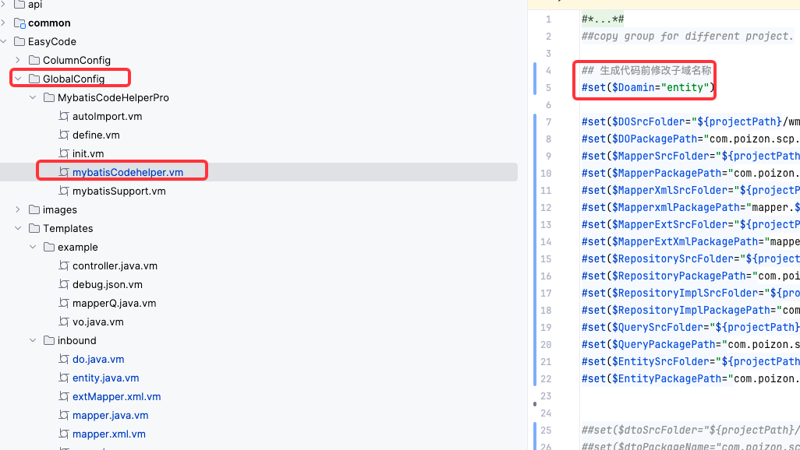
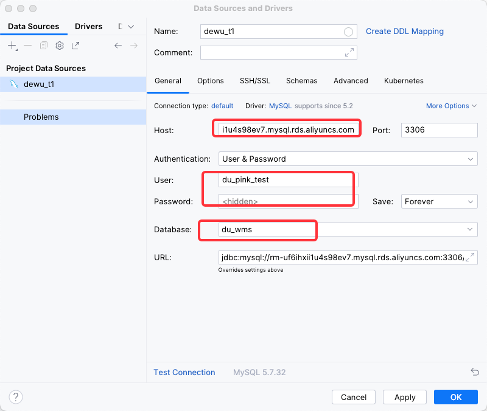
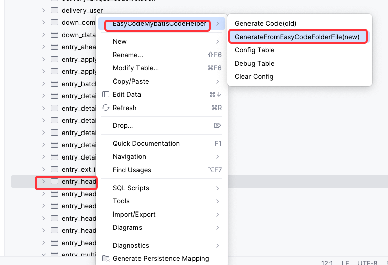
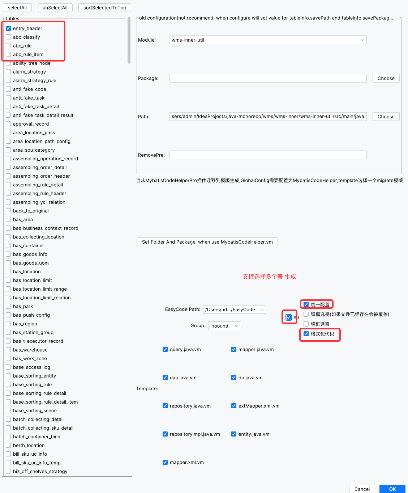
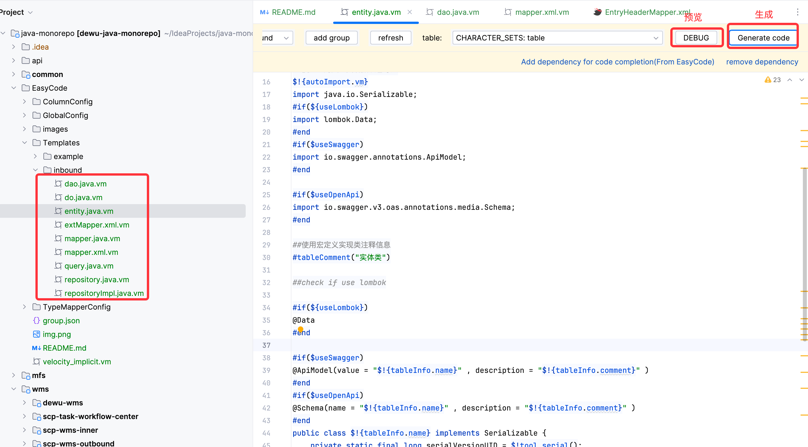

# 概要
使用此代码生成器
1. 先安装两个插件：
- MybatisCodeHelper 【非必要，推荐，强大且好用】
- EasyCode-MybatisCodeHelper 【必要】
- 按照不同的子域，可以配置代码生成的位置：

2. 使用IDEA的DataBase连接数据库，例如：
- T1 测试环境地址：rm-uf6ihxii1u4s98ev7.mysql.rds.aliyuncs.com
- 密码：自己查询

3. 打开DataBase，选择对应的表

4. 选择对应表和需要生成的模版即可

5. 也可以选择对应的模版，单独生成/预览：

目前Inbound模版库里按照入库编码规范生成，其他团队可以自己定制，也可以找@灭霸协助；